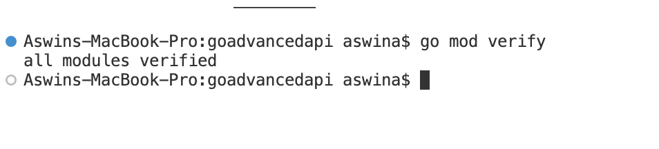
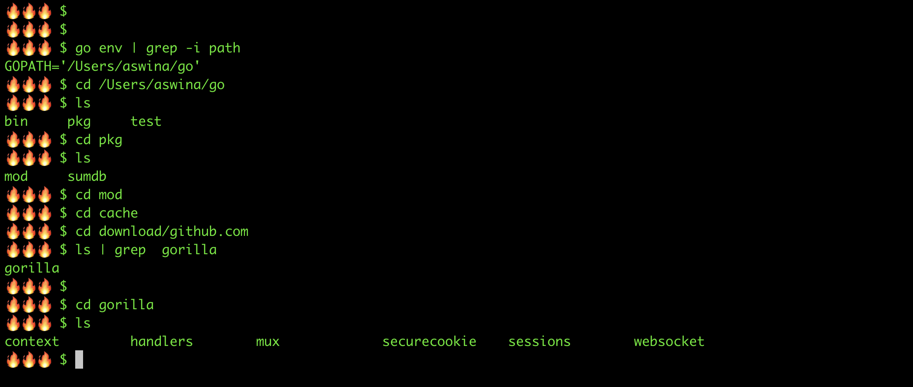
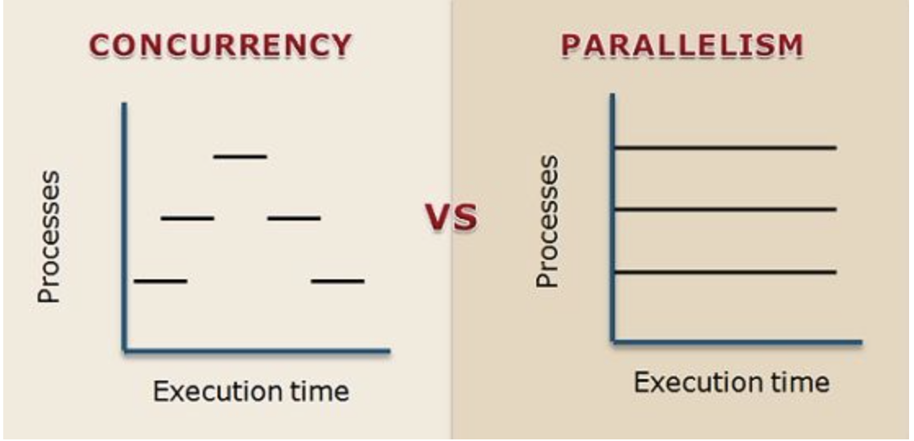

# Go Basics

- `go mod init` : Initializes a new module in the current directory. It creates a go.mod file that defines the module's path and sets it up for dependency management.
- `go mod tidy` : Adds missing and removes unused modules and dependencies from the go.
- walrus Operator: The symbol is `:=` and this will automatically determine the variable type. This can be declared only inside a method/function and this way of declaring a varible is not permitted outside a function
- If you decalre a variable with capital letter then it becomes public and it will be available to access for other files in the same package
- In Go, := is for declaration + assignment, whereas = is for assignment only.
  - For example, var foo int = 10 is the same as foo := 10

## To verify all the package



## go help command

To get more information about the usage of various go commands we can use `go help <command-name>`. For example if we want to check where we installed go binary then we need to use `gopath` command. To check the `gopath` command usage we can run `go help gopath`.

It will show below result along with some other details

```log
If the environment variable is unset, GOPATH defaults to a subdirectory named "go" in the user's home directory ($HOME/go on Unix, %USERPROFILE%\go on Windows), unless that directory holds a Go distribution. Run "go env GOPATH" to see the current GOPATH.
```

So all you need to do is run

```bash
🔥🔥🔥 $ go env GOPATH
/Users/aswina/go  
```

## Building go binary for various Operating Systems

we can use `GOOS` environment varibale to build go binaries for all the operating system regardless of the host OS. For example if you are on Mac, and you need to build go binary for windows then you need to run

```bash
GOOS="windows" go build
GOOS="linux" go build  ## For linux
```

## To download a package run

```bash
go get <packageName>


#example
go get "k8s.io/cli-runtime/pkg/genericclioptions"
```

### Here is where the packages downloaded from the internet resides



## To check which package my application is dependend on run

```bash
go list -m all
```

## Memory Management in Golang

- new()
  - Allocate memory but not initilize it
  - You will get a memory address
  - `new` in Golang is a keyword that is used to instantiate a struct (custom data type). The new keyword returns a pointer to the instantiated variable. It creates a "zeroed" storage for a new item.
- make()
  - When you use make(), memory is allocated and initialized
  - You will get a memory address
  - `make` in Golang is a keyword that is used to initialize only slices, maps, and channels. Unlike the `new` keywords, it does not return the pointer to the item. It initializes the data in memory with zero value.
- Garbage collection happens automatically( Anything that is out of scope or nil is eligible for Garbage collection)
- The **`GOGC`** (go garbage collection) variable sets the initial garbage collection target percentage.


## Pointers

- A pointer is a direct reference to the memory address, and since you are passing on that address it makes 100% garuntee that the actual value is being passed.

## Functions

- func <function_name> (x DataType, y DataType) ReturnType {}

example

```go
func adder(num1 int, num2 int) int{
  return num1 + num2
}
```

- If the number of input parameters to a functions is not certain, then we can use below syntax

- func <func_name>(variableName ...DataType) ReturnType{}

```go

func proAdder(values ...int) int {
	total := 0
	for _, val := range values {
		total += val
	}
	return total
}

```

- Functions in golang can return more data of more than one data type. The Syntax for that is:

- func <funcName>(varName DataType) (ReturnDataType, ReturnDataType)

```go
func addPrint(numbers ...int) (int, string) {
	tot := 0
	for _, v := range numbers {
		tot += v
	}
	return tot, "Some message"
}

```

## Methods

Go does not have classes. However, you can define methods on types. A method is a function with a special receiver argument. The receiver appears in its own argument list between the func keyword and the method name.

Syntax: 

`func (ReceiverArgs) functionName() {}`

example

```go

type User struct {
	Name string
	Id   int
	Age  int
}

func (u User) getUserData() {
	fmt.Println("User Name is ", u.Name)
}

func main() {
	user := User{"Aswin", 1, 27}
	user.getUserData()
}

```

### Detailed description

In Go, a method is a function associated with a particular type. It allows you to attach functions to a specific type, enabling you to perform actions on instances of that type. Methods are defined with the func keyword, followed by the receiver type and the method name.

```go
package main

import "fmt"

// Define a type named "Person"
type Person struct {
    FirstName string
    LastName  string
}

// Define a method for the "Person" type
func (p Person) FullName() string {
    return p.FirstName + " " + p.LastName
}

func main() {
    // Create an instance of the "Person" type
    person := Person{FirstName: "Aswin", LastName: "Ayyolath"}

    // Call the method on the person instance
    fullName := person.FullName()

    // Print the result
    fmt.Println("Full Name:", fullName)
}

```

In this example:

- We define a type called Person with two fields: FirstName and LastName.
- We create a method called `FullName` that is associated with the Person type. It takes a Person receiver (the `p` parameter) and returns the full name by combining the first and last names.
- In the `main` function, we create an instance of the Person type and call the FullName method on it.
Output:

## defer keyword

In Golang, the defer keyword is used to delay the execution of a function or a statement until the nearby function returns.

In simple words, defer will move the execution of the statement to the very end inside a function. (When a function executes it excute line by line eventhough it is compiled thats how the flow works. when we put defer keyword the statement will not execute at that place but it will get executed at the very end of the function)

## Concurrency vs Parallelism

- Concurrency is like juggling multiple tasks at the same time.
- In computing, concurrency refers to the ability of a system to handle multiple tasks or processes at the same time. Even if they don't run simultaneously, they appear to make progress concurrently.
- In computing, parallelism involves executing multiple tasks or processes simultaneously by breaking them into smaller sub-tasks and processing those sub-tasks in parallel.
- Concurrency is about managing multiple tasks and making progress on all of them over time.
- Parallelism is about simultaneously executing multiple tasks or parts of a task.



## goroutine

In Go, a goroutine is a lightweight thread managed by the Go runtime. Goroutines enable concurrent programming in a simple and efficient way. They are functions that run concurrently with other functions, allowing you to perform multiple tasks simultaneously.

### Creating a Goroutine

To create a goroutine, you use the go keyword followed by a function call. For example:

```go
package main

import (
    "fmt"
    "time"
)

func sayHello() {
    fmt.Println("Hello from the goroutine!")
}

func main() {
    // Start a new goroutine
    go sayHello()

    // The main function continues to execute independently of the goroutine
    fmt.Println("Hello from the main function!")

    // Allow some time for the goroutine to finish
    time.Sleep(time.Second)
}

```

In this example, `sayHello` runs concurrently with the main function. The time.Sleep is used to give the goroutine some time to complete before the program exits.

### Passing Data to Goroutines

You can pass data to a goroutine by including parameters in the function call. Here's an example:

```go
package main

import (
    "fmt"
    "time"
)

func greet(name string) {
    fmt.Println("Hello, " + name + "!")
}

func main() {
    // Start a goroutine with a parameter
    go greet("Alice")

    // Continue with the main function
    fmt.Println("Greetings from the main function!")

    // Allow some time for the goroutine to finish
    time.Sleep(time.Second)
}

```

### Anonymous Functions and Goroutines:

```go
package main

import (
    "fmt"
    "time"
)

func main() {
    // Start a goroutine with an anonymous function
    go func() {
        fmt.Println("Hello from the anonymous goroutine!")
    }()

    // Continue with the main function
    fmt.Println("Hello from the main function!")

    // Allow some time for the goroutine to finish
    time.Sleep(time.Second)
}

```

In this case, the `go func() { ... }()` syntax creates and runs an anonymous function as a goroutine.

Goroutines are a key feature of Go, making it easy to write concurrent programs. They allow you to perform multiple tasks concurrently, improving the efficiency and responsiveness of your programs

In Go programming language, the sync package provides a **`WaitGroup`** type that helps manage concurrency by allowing you to wait for a collection of goroutines (concurrently executing functions) to finish before proceeding. The **`WaitGroup`** is particularly useful when you have multiple goroutines and need to synchronize their execution.

#### Add(delta int) method

- `Add` is used to add delta, which can be a positive or negative integer, to the WaitGroup counter.
- If delta is positive, it represents the number of goroutines that are about to be added to the wait group.
- If delta is negative, it represents the number of goroutines that have finished and should be removed from the wait group.

```go
var wg sync.WaitGroup
wg.Add(1) // Increment the counter by 1, indicating one goroutine will be added.
go func() {
    defer wg.Done() // Decrement the counter when the goroutine is done.
    // Your goroutine logic here
}()

```

#### Done() method

- `Done` decrements the WaitGroup counter by 1, indicating that a goroutine has finished.
- It's usually deferred at the beginning of the goroutine to ensure that it is called even if the goroutine encounters an error or panics.

```go
go func() {
    defer wg.Done() // Decrement the counter when the goroutine is done.
    // Your goroutine logic here
}()

```

#### Wait() method

- `Wait` blocks until the WaitGroup counter becomes zero. It waits for all added goroutines to call Done() and decrement the counter to zero.
- It's typically called in the main goroutine or the function that needs to wait for all other goroutines to finish.

```go
wg.Wait() // Wait until the counter becomes zero (all goroutines are done).
```

## Mutex

In Go, a mutex (short for `mutual exclusion`) is a synchronization primitive used to protect shared data by ensuring that only one goroutine can access the shared resource at a time. It stands for `mutual exclusion` because it prevents multiple goroutines from simultaneously accessing the same critical section of code or data.

### Creating a Mutex

To use a mutex, you first need to create an instance of the `sync.Mutex` type.

```go
import "sync"

var mutex sync.Mutex

```

### Locking and Unlocking

- The Lock method is used to acquire the lock (mutex), and Unlock is used to release the lock.
- When a goroutine acquires the lock using Lock, other goroutines attempting to acquire the lock will be blocked until the lock is released using Unlock.

```go
mutex.Lock()
// Critical section: Shared data is accessed/modified here.
mutex.Unlock()

```

### Using a Mutex to Protect Shared Data

When multiple goroutines need to access shared data, a mutex can be used to ensure that only one goroutine accesses the data at a time.

```go
var sharedData int
var mutex sync.Mutex

// Goroutine 1
go func() {
    mutex.Lock()
    // Access or modify shared data
    sharedData++
    mutex.Unlock()
}()

// Goroutine 2
go func() {
    mutex.Lock()
    // Access or modify shared data
    sharedData--
    mutex.Unlock()
}()

```

In this example, the mutex ensures that only one goroutine can access or modify sharedData at a time.

Mutexes are essential for preventing data races and ensuring the correct behavior of concurrent programs. However, it's important to use them judiciously, as excessive use of mutexes can lead to performance bottlenecks and defeat the purpose of concurrency. In some cases, other synchronization mechanisms, such as channels, may be more appropriate.

# Race Conditions

In Go, a race condition occurs when two or more goroutines access shared data concurrently, and at least one of them modifies the data. If proper synchronization mechanisms are not in place, it can lead to unpredictable behavior and bugs in your program. Go provides tools to help identify and handle race conditions.

### Use Mutexes

- As mentioned earlier, mutexes (mutual exclusion) can be used to protect shared data. By locking and unlocking a mutex, you can ensure that only one goroutine at a time can access the critical section of code that involves shared data.

```go
var sharedData int
var mutex sync.Mutex

// Goroutine 1
go func() {
    mutex.Lock()
    // Access or modify shared data
    sharedData++
    mutex.Unlock()
}()

// Goroutine 2
go func() {
    mutex.Lock()
    // Access or modify shared data
    sharedData--
    mutex.Unlock()
}()

```

### Use the sync Package

The `sync` package in Go provides various synchronization primitives, including `Mutex` as discussed earlier. It also offers other constructs like `RWMutex` (for read/write locks) and `WaitGroup` (for waiting for a collection of goroutines to finish).

### Atomic Operations

The `atomic` package in Go provides atomic operations that are executed without interruption. These operations can be used for simple, low-level atomic actions on variables, helping to avoid race conditions.

```go
var sharedData int32

// Goroutine 1
go func() {
    atomic.AddInt32(&sharedData, 1)
}()

// Goroutine 2
go func() {
    atomic.AddInt32(&sharedData, -1)
}()

```

### Use go run -race

Go provides a built-in race detector that can be enabled by using the `-race` flag when running your program (`go run -race yourprogram.go`). This tool can help you identify and diagnose race conditions during runtime.

### Channels

Channels are a higher-level synchronization mechanism in Go. By sending data through channels, you can ensure that only one goroutine is the owner of the data at a time.

```go
var sharedData int
var dataChan = make(chan int)

// Goroutine 1
go func() {
    dataChan <- 1
}()

// Goroutine 2
go func() {
    value := <-dataChan
    // Access or modify shared data
    sharedData += value
}()

```

## More on Channels

In Go, a `chan` is short for `channel`. Channels are a fundamental concurrency primitive in Go and are used for communication and synchronization between goroutines (concurrently executing functions). Channels provide a way for one goroutine to send data to another goroutine.

### Brief overview of how channels work in Go

#### Creating a Channel

You can create a channel using the make function

```go
ch :=  make(chan int) //This creates a channel of integers.
```

#### Sending and Receiving Data

```go
ch <-42 //You can send data into a channel using the <- operator:
```

```go
value := <-ch //And you can receive data from a channel using the same operator
```

**Note**: The `<-` operator is used both for sending and receiving, and the direction is determined by whether it appears on the left or right side of the channel variable.

#### Blocking and Synchronization

When a goroutine attempts to send data to a channel, it will block until another goroutine is ready to receive from that channel, and vice versa. This built-in synchronization helps prevent race conditions and ensures safe communication between goroutines.

```go
// This will block until there's a receiver ready to read from the channel.
ch <- 42

// This will block until there's data to read from the channel.
value := <-ch

```

#### Closing a Channel

You can close a channel to signal that no more data will be sent on it. Receivers can use multiple return values to detect if a channel has been closed:

```go
close(ch)
```

```go
value, ok := <-ch
```

The ok value will be false if the channel is closed and there is no more data to be received.

Channels are a powerful tool for managing concurrency in Go, and they play a crucial role in the language's support for concurrent programming. They help facilitate communication and coordination between different parts of a program that run concurrently.
